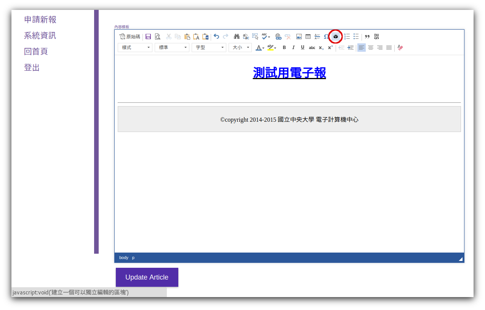
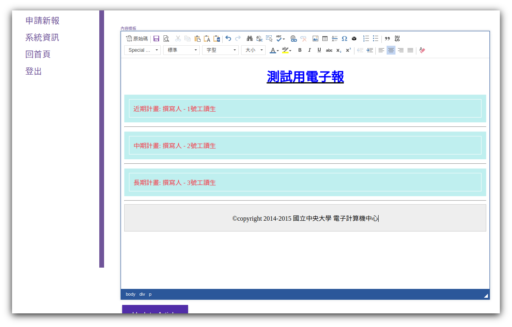
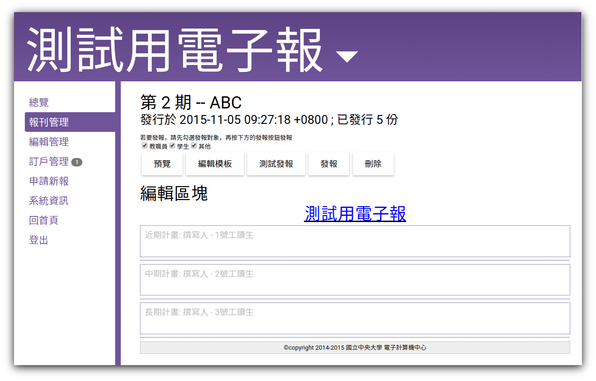
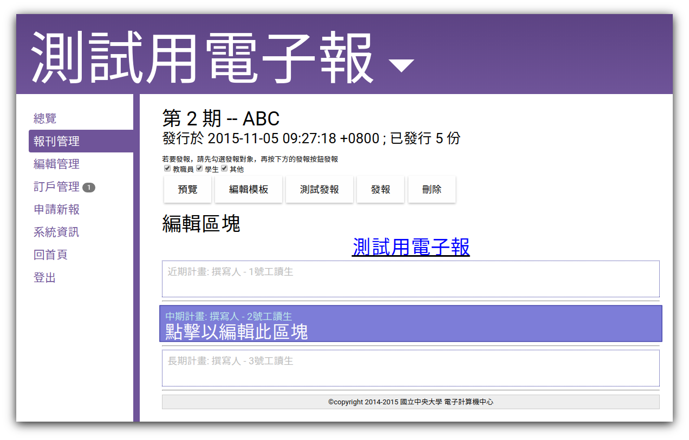
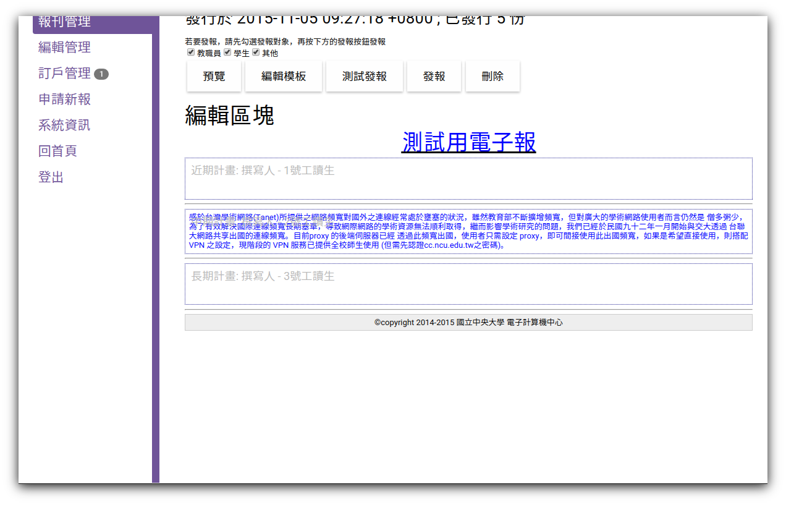

# 線上編輯電子報

新版電子報提供方便的線上編輯平台，使得新增/編輯電子報成為簡單的工作。

## 樣板

一份電子報的製作，往往涉及許多**區塊**需要設計與撰稿（例如：分成「社會」、「體育」、 「財經」、「社論」四個部份，分別由四位小編撰寫）。為了加速您電子報的製作，epaper 提供一個名為**樣板**的功能，讓您為每一份即將發行的報紙製作一個**樣板**，**樣板**有 著整份電子報的基本雛型，其中您可以預先放入多個**區塊**，以待往後的編輯或者工作的分配。

## 區塊

一個**區塊**是電子報中的獨立可編輯區域，電子報總編可以將整份電子報分成若干區塊，交由不同的小編撰寫，以方便報紙的頁面管理與設計。

## 使用方式

### 新增與編輯樣板

-	新增報紙的同時，可以同時製作該報紙的樣板。如圖1所示。 
-	新增報紙的同時，可以同時編輯該報紙的樣板。如圖2所示。  -

### 新增區塊

編輯樣板時，於**編輯器**上方有一個圖案，點擊並填入區塊資訊後，即可於當前游標處新增一個**區塊**。
    1. 點擊圖案
    2. 輸入區塊資訊
    3. 點擊**確定**即可插入區塊（範例中連續插入三個區塊）
    4. 點擊編輯器左上角的圖案儲存變更。即可於看見報刊樣板中已經預留了**區塊**，可於日後進行編輯

### 編輯區塊

報紙的顯示頁面（**報刊管理**→**報刊列表**→**點擊報紙**），除了可以看見此報紙的樣板之外，也可以直接點擊欲編輯區塊，開啟編輯器直接編輯。
    1. 於欲編輯的區塊上點擊滑鼠左鍵
    2. 編輯區塊內容
    3. 點擊編輯器左上角的圖案儲存變更
    4. 點擊上方的**預覽**按鈕，可以觀看區塊呈現於整份報紙的樣子。
